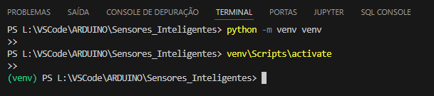
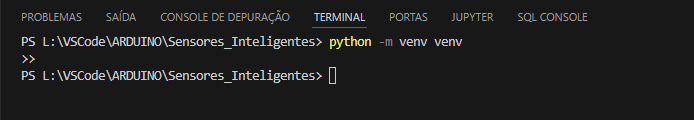
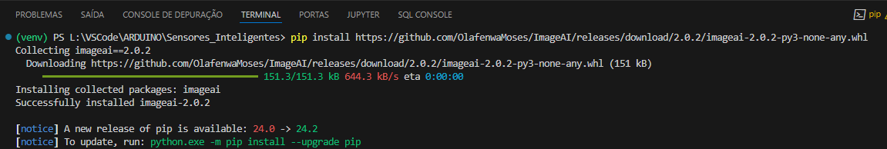
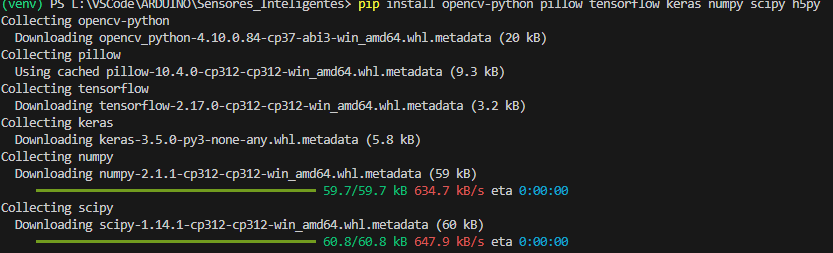
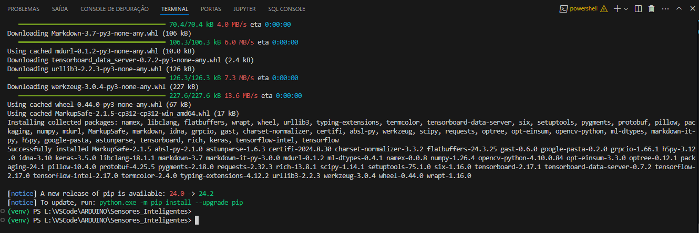
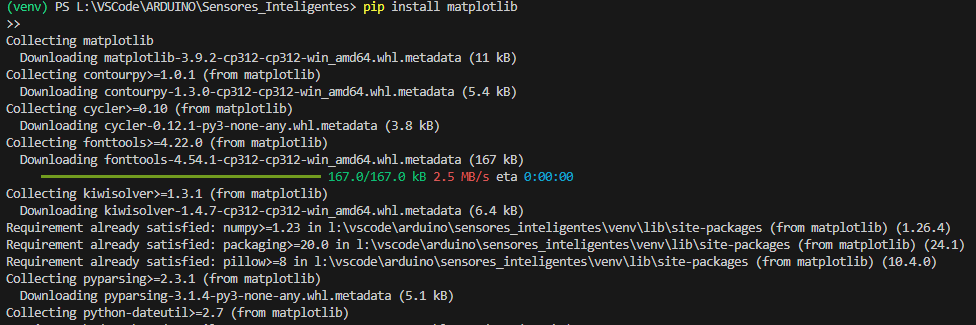
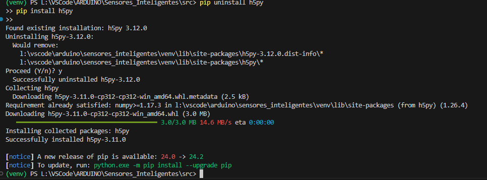
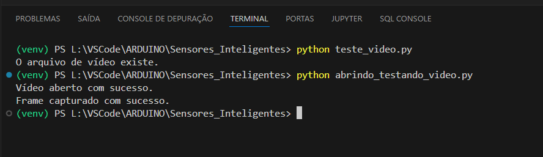

# Detecção de Movimento com OpenCV

## Objetivo

O objetivo deste projeto foi desenvolver uma aplicação em Python utilizando a biblioteca **OpenCV** para detectar movimentos em vídeos. A aplicação processa frames de um vídeo de entrada e identifica movimentos através da subtração de fundo. Retângulos são desenhados ao redor das áreas em movimento, e os resultados são salvos em um vídeo de saída.

## Estrutura do Projeto

A estrutura de pastas do projeto é a seguinte:

    IoT_Sensores_Inteligentes/
    │
    ├── config/
    │   └── yolo_config.json
    ├── data/
    │   ├── annotations/
    │   ├── images/
    │   ├── models/
    │   │   └── yolo.h5
    │   └── videos/
    |   |_____frames/
    │   ├── input_video.mp4    # Vídeo de entrada com pássaros voando
    │   └── output_video.avi   # Vídeo de saída com contornos detectados
    ├── notebooks/
    ├── src/
    │   ├── motion_detection.py    # Código principal para detectar movimento
    │   └── test_import.py
    ├── README.md
    └── venv/

- **config/**: Configurações do modelo YOLO (não utilizado neste desafio).
- **data/**: Contém os vídeos de entrada e saída, além de possíveis anotações e imagens.
- **src/**: Código-fonte da aplicação Python.
- **notebooks/**: Diretório para possíveis notebooks Jupyter (vazio).
- **.gitignore**: Arquivo para definir os arquivos a serem ignorados no controle de versão.
- **README.md**: Este documento.

## Ferramentas Utilizadas

- **Python 3.x**: Linguagem de programação utilizada.
- **OpenCV**: Biblioteca usada para processamento de imagens e vídeos.
- **VSCode**: Editor de código.
- **Git/GitHub**: Controle de versão e hospedagem do repositório.
- **TensorFlow/Keras**: Preparado para utilização de modelos de detecção (não usado neste desafio).

## Explicação Técnica

A aplicação lê um vídeo de entrada, converte os frames para escala de cinza e aplica um desfoque gaussiano. Ela calcula a diferença entre o primeiro frame (usado como referência) e os frames subsequentes, destacando as áreas de movimento. Essas áreas são cercadas por retângulos e o vídeo processado é salvo como um novo arquivo.

### Principais passos

1. **Captura de vídeo**: O vídeo de entrada é lido usando `cv2.VideoCapture`.
2. **Subtração de fundo**: A diferença entre o frame inicial e os subsequentes é calculada para detectar movimento.
3. **Desenho de retângulos**: Retângulos são desenhados ao redor das áreas de movimento detectadas.
4. **Gravação de vídeo**: O vídeo processado é salvo com o codec `XVID`.

### Exemplo de Código

    def detect_motion_in_video(input_video_path, output_video_path):
        # Capturar o vídeo de entrada
        cap = cv2.VideoCapture(input_video_path)

        # Verificar se o vídeo foi aberto corretamente
        if not cap.isOpened():
            print("Erro ao abrir o vídeo.")
            return

        # Obter o primeiro frame do vídeo
        ret, first_frame = cap.read()

        # Conversão para escala de cinza e desfoque
        first_gray = cv2.cvtColor(first_frame, cv2.COLOR_BGR2GRAY)
        first_gray = cv2.GaussianBlur(first_gray, (21, 21), 0)

        # Processamento de frames e detecção de movimento...

## Projeto de Detecção de Movimento

### Imagens do Processo

### 1. Ativação do Ambiente Virtual

### 2. Verificação do Ambiente Virtual

### 3. Instalação das Dependências - Parte 1

### 4. Instalação das Dependências - Parte 2

### 5. Instalação das Dependências - Parte 3

### 6. Instalação do Matplotlib

### 7. Reinstalação do H5py

### 8. Testando Abertura de Vídeo

## Exemplo de Execução

Aqui estão exemplos dos resultados obtidos com o vídeo de entrada de pássaros voando, processado pela lógica do código:
Print 1: Vídeo de Entrada

Vídeo de Entrada
Print 2: Movimento Detectado

Movimento Detectado
Print 3: Vídeo de Saída

Vídeo de Saída

    Nota: Os prints acima mostram a detecção de movimento em áreas com atividade visível no vídeo.

## Como Rodar o Projeto

## Clone este repositório

git clone <https://github.com/IOVASCON/IoT_Sensores_Inteligentes.git>

cd NOME_DO_REPOSITORIO

## Instale as dependências

pip install -r requirements.txt

## Execute o script principal para detectar movimento

    python src/motion_detection.py

    O vídeo de saída será salvo no caminho especificado no código.

## Conclusão

Este projeto demonstrou a implementação de uma detecção de movimento simples usando OpenCV, onde frames de um vídeo foram processados para detectar atividade, salvando os resultados em um novo vídeo. As ferramentas utilizadas permitiram a captura de eventos e a visualização de áreas com movimento destacado.
